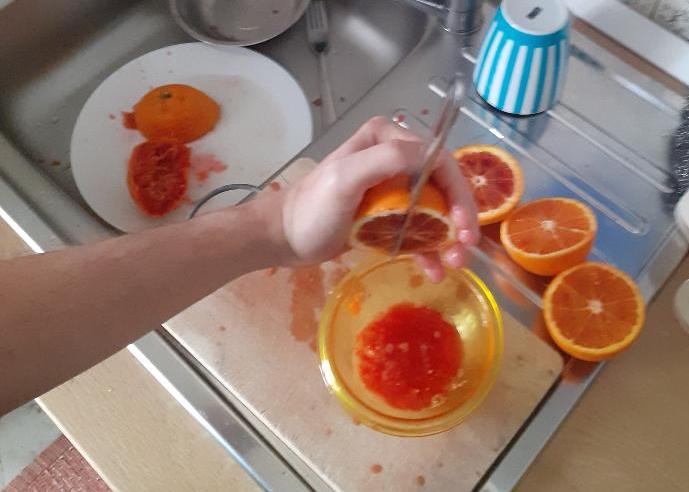
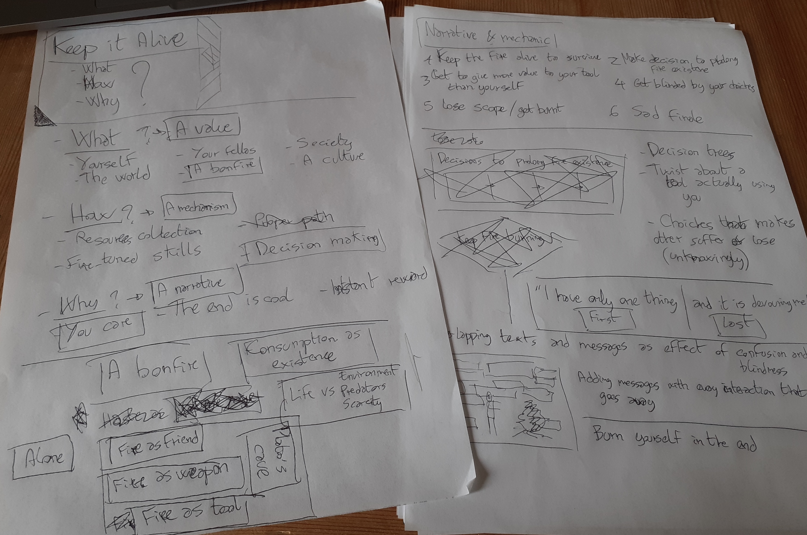
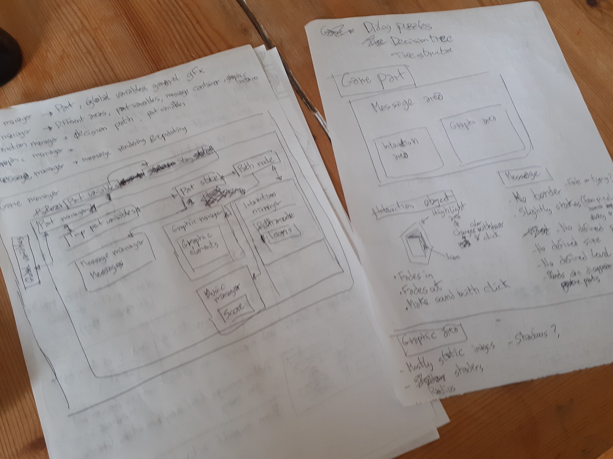
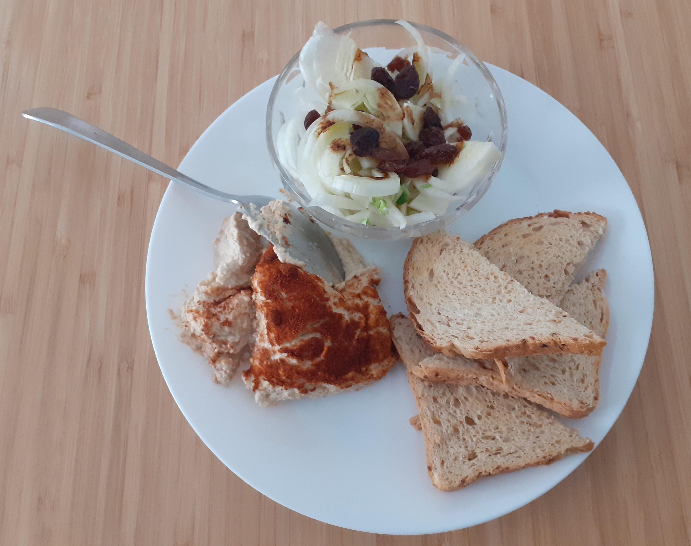

# Log

## Saturday 18th

### 10:00
Woke up after plenty of sleep but with several hours after the kick-off of Ludum Dare. I went to check the theme, and it ended being the one that I wanted the least... **Keep it alive...**

In my initial brainstorming, the only idea I came up with was as ridiculous as impossible to translate into a game, at least with the short time at disposal:

> "The quest of a man to make disco music hype again"

Yeah, that sounds fun but honestly is nothing more than that. But I've to come up with more apt ideas.

Not before breakfast though.

### 11:38
Ok, a short breakfast but a long phone call later I'm finally ready. The jam is almost 9 hours deep and I yet have to come up with a single feasible idea.
Many pro at this point already have sketched narratives and mechanisms, figured out graphic designs, tested prototypes and few might be even close to submission.

I don't even know where to start.

Let's grab some pen & paper and get some shit together.

### 12:28
Hey! After two pages of random notes I've an idea!

And a name for it! My game will be called **One Thing**.

And a genre! It will be a point-and-click game!

### 13:18
Ok, I think I nailed out a concept and some game mechanics. I've also opted to choose Unity as environment for its fast prototyping approach.
I haven't opened it in the last couple of years, but what could have possibly changed in the meantime?

Oh, jeez. Yes. Everything. This is going to be harsh.

### 14:08
After some research on tree structures and decision threes, and a prayer to Ron Gilbert, patron saint of point-and-click games, it's about time to define some system components and the relations among them.

These sketches might be confusing, but only because they really are. But in this way - shoving down confusion over a sheet of paper - I made some clarity on my mind and it's time to move on.

The next steps will be to make a development roadmap and start to prototype the various managers of the game.

### 14:29
I haven't wrote a single line of code yet, but it's definitely time for a lunch break.

