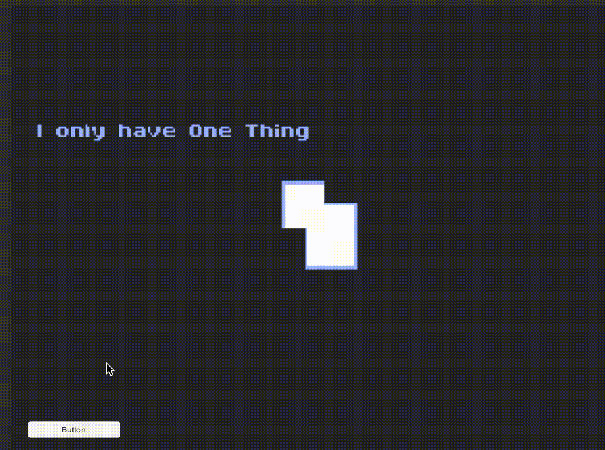

# Log

## Saturday 18th

### 10:00
Woke up after plenty of sleep but with several hours after the kick-off of Ludum Dare. I went to check the theme, and it ended being the one that I wanted the least... **Keep it alive...**

In my initial brainstorming, the only idea I came up with was as ridiculous as impossible to translate into a game, at least with the short time at disposal:

> "The quest of a man to make disco music hype again"

Yeah, that sounds fun but honestly is nothing more than that. But I've to come up with more apt ideas.

Not before breakfast though.

### 11:38
Ok, a short breakfast but a long phone call later I'm finally ready. The jam is almost 9 hours deep and I yet have to come up with a single feasible idea.
Many pro at this point already have sketched narratives and mechanisms, figured out graphic designs, tested prototypes and few might be even close to submission.

I don't even know where to start.

Let's grab some pen & paper and get some shit together.

### 12:28
Hey! After two pages of random notes I've an idea!

And a name for it! My game will be called **One Thing**.

And a genre! It will be a point-and-click game!

### 13:18
Ok, I think I nailed out a concept and some game mechanics. I've also opted to choose Unity as environment for its fast prototyping approach.
I haven't opened it in the last couple of years, but what could have possibly changed in the meantime?

Oh, jeez. Yes. Everything. This is going to be harsh.

### 14:08
After some research on tree structures and decision threes, and a prayer to Ron Gilbert, patron saint of point-and-click games, it's about time to define some system components and the relations among them.

These sketches might be confusing, but only because they really are. But in this way - shoving down confusion over a sheet of paper - I made some clarity on my mind and it's time to move on.

The next steps will be to make a development roadmap and start to prototype the various managers of the game.

### 14:29
I haven't wrote a single line of code yet, but it's definitely time for a lunch break.

### 17:08
After two hours of coding I was able just to test a very dull UI experiment.

But - hey! - at least it works.

### 18:51
More text on UI elements and behavior.

Time for a pause because my son wants to play with Minecraft.

### 23:49

I know this looks more like a food-porn Instagram account than a game jam log, but iot was dinner time and I already had pizza dough ready and I was hungry!

Beyond meals, I had to waste a couple of hours for remote IT assistance (on Saturday evening!!!) and then did more experiments of UI elements.

We're getting somewhere.

## Sunday 19th

### 00:25
I know this is not a primary goal, but I found a lovely font I want to use!

Thank you [Philippe Moesch](https://www.behance.net/philippemoesch) for designing it and letting anyone in the world to use it for free.

### 02:54
As expected, I was slower than expected.

I made many more tests and implementations on the UI/UX side and their management. If I focused a lot on this part of the game it's because:
- The game will essentially be a guided interaction, so the UI should be really fine-tuned;
- I got lost into a stupid bug over UI positioning for more than one hour and I felt incredibly stupid;

The overall feel is still incredibly crude and undefined, but many more things are becoming clearer in my vision.

Now it's time some nap.

Tomorrow I'll start integrating the various managers, setting game parts parameters and thinking on the assets.

### 12:55
After plenty of sleep, I woke with the idea of of keep on testing with UI elements and game managers to the point where the game implementation was nothing more than defining global variables and arrays.

I was wise and naive at the same time. Wise because this approach is saving the future perplexities regarding how to achieve certain interactions that I didn't foresaw. Naive because I totally forgot everything I knew about under-the-hood Unity functionalities, and I'm stumbling over even the most stupid bugs (goddam!!! You should scrpt GameObject associations at *Awake()*, not *Start()*!!!).

I'm definitely behind any reasonable schedule for a Compo submission, let's see if the Jam is still reachable.

Nonetheless, what I'm realizing is that even if I'm not to craft anything playable, the process is letting me understand more about patterns, algorithms and UI/UX abstractions.

And that's a really valuable lesson!
